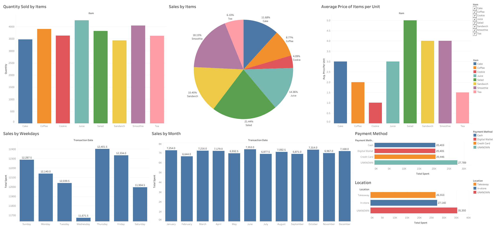

# Cafe Sales Analysis

### Project Overview

---

 Developed interactive Tableau dashboards to visualize key insights from a café sales dataset, highlighting sales trends, top-selling items, and revenue patterns. Cleaned and preprocessed the dataset using Python's pandas library to ensure data accuracy and reliability. 

### Data Sources

 
The primary dataset used is the <a href="https://github.com/mahmud-ashiq/data_science/cafe_sales/cafe_sales.csv"><nobr>cafe_sales.csv</nobr></a>

Processed data used for analysis: <a href="https://github.com/mahmud-ashiq/data_science/cafe_sales/processed_data.csv"><nobr>processed_data.csv</nobr></a>

Kaggle: [Dataset](https://www.kaggle.com/datasets/ahmedmohamed2003/cafe-sales-dirty-data-for-cleaning-training)

### Tools

- Python
- Tableau

### Data Preprocess

The details of the data preprocessing methods are documented in the Jupyter Notebook file named [data_cleaning.ipynb](https://github.com/mahmud-ashiq/data_science/cafe_sales/data_cleaning.ipynb)

### Exploratory Data Analysis

EDA involved exploring the data to answer key questions such as:

- Which menu item had the highest sales volume?
- On which weekday did the café generate the lowest revenue?
- Which menu item contributed the most to total revenue?

### Results

- The item with the highest sales volume was Juice, indicating strong customer preference and demand.
- Wednesday, with total sales amounting to $11,671.50, suggesting a potential opportunity for targeted promotions or special offers to boost midweek sales.
- Smoothie was the highest revenue-contributing item, accounting for 18.15% of total sales, highlighting its significance in overall profitability.

# Dashboard

### [Tableau Public](https://public.tableau.com/app/profile/mahmud.al.ashiq/viz/CafeSales_17381579599820/Dashboard)

